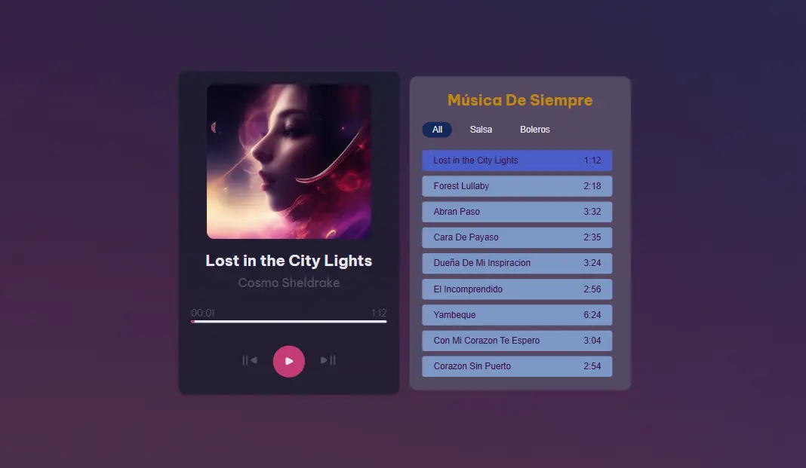

<h1 style="text-align: center;">Music Player App</h1>

## Descripción

Este proyecto es un reproductor de música web que permite a los usuarios reproducir, pausar y navegar a través de una lista de canciones. El reproductor incluye una interfaz de usuario interactiva con información de la canción, una barra de progreso y controles de reproducción.

## Características

- Reproducción y pausa de canciones
- Navegación a la siguiente canción
- Visualización de la información de la canción (título, artista, portada)
- Barra de progreso que muestra el tiempo transcurrido y la duración total de la canción
- Lista de reproducción interactiva

## Vista Previa



Puedes ver la versión demo en vivo aquí: [Music Player](https://music-player-chi-six.vercel.app/)

## Tecnologías Usadas

- **HTML5**: Para la estructura de la página web.
- **CSS3**: Para el diseño y la disposición de los elementos en la página.
- **JavaScript (ES6+)**: Para la lógica del reproductor de música y la manipulación del DOM.

## Instalación

1. Clona el repositorio:
    ```bash
    git clone https://github.com/Ibrahim-003/Music-Player.git
    ```

2. Navega al directorio del proyecto:
    ```bash
    cd reproductor-musica
    ```

3. Abre el archivo [index.html](http://_vscodecontentref_/1) en tu navegador web.

## Estructura del Proyecto

```
├── index.html
├── assets/
├── css/
├── js/
│   ├── main.js
│   ├── songInfo.js
│   ├── progressBar.js
│   ├── playerControls.js
│   ├── utils.js
│   └── songList.js
└── README.md
```

## Uso

1. Abre el archivo [index.html](http://_vscodecontentref_/2) en tu navegador.
2. La lista de reproducción se mostrará en la interfaz.
3. Haz clic en el botón de reproducción para comenzar a reproducir la canción seleccionada.
4. Usa los controles de reproducción para pausar, reproducir o navegar a la siguiente canción.
5. La barra de progreso se actualizará automáticamente para reflejar el tiempo transcurrido y la duración total de la canción.

## Autor 👨‍💻

Desarrollado por **[Ibrahim Almeyda](https://github.com/Ibrahim-003)**.
